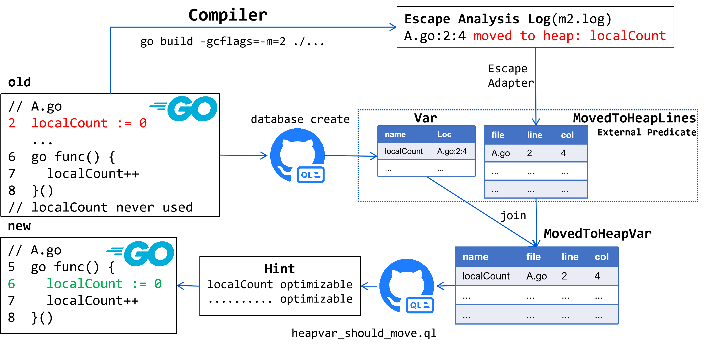

# Escape Analysis Extension

## Architecture



The escape analysis extension in QLStat enables integration of Go's compiler escape analysis data with CodeQL queries. This allows developers to analyze memory allocation patterns and identify variables that are allocated on the heap versus stack.

The architecture follows these steps:

1. **Compilation with Escape Analysis**: The Go compiler is invoked with `-gcflags=-m=2 ./...` to generate detailed escape analysis information during compilation.
2. **Log Collection**: The compiler's stderr output containing escape analysis results is captured in log files (e.g., `m2.log`).
3. **Data Extraction**: The escape_adapter tool parses these logs and extracts information about which variables are moved to the heap.
4. **Predicate Generation**: The extracted data is converted into CSV format as external predicates for CodeQL.
5. **Query Integration**: CodeQL queries can reference this external predicate data to correlate code patterns with memory allocation behavior.

This extension bridges static analysis (CodeQL) with compiler-level optimization insights, enabling sophisticated queries about memory usage patterns across large codebases.

## Example Usage

The following example from [movedtoheap_test.yaml](../../cmd/escape_adapter/movedtoheap_test.yaml) demonstrates how to use the escape analysis extension:

```yaml
# Configuration for escape analysis extension
externalGenGrps:
  - genRepos:
      - "-"
    genScript: goescape  # This triggers go build with -gcflags=-m=2 ./...

queryconfig:
  queryGrps:
    - queryRepos:
        - escape
      queries:
        - escape_ext/moved_to_heap_var_test.ql # The queries you want to use
      externals:
        - movedToHeap  # Reference the external predicate in your query group
```

In this configuration:
- `genScript: goescape` instructs the system to compile repositories with escape analysis enabled
- `externals: [movedToHeap]` makes the escape analysis data available to the specified queries
- The query [`escape_ext/moved_to_heap_var_test.ql`](../../qlsrc/escape_ext/moved_to_heap_var_test.ql) can then use the `movedToHeap` predicate to identify variables that escape to the heap

This enables queries that answer questions like "Which functions have parameters that always escape to the heap?" or "What patterns correlate with heap allocation in goroutines?"

You can also use [demo.sh](../../demo.sh) as your first try.

## Small Wins

The following performance improvements are detected by [`escape_ext/heapvar_should_move.ql`](../../qlsrc/escape_ext/heapvar_should_move.ql).

| Repository                                                    | Problematic Commit | Pull Request                               |
| ------------------------------------------------------------- | ------------------ | ------------------------------------------ |
| [rclone/rclone](https://github.com/rclone/rclone/tree/master) | 73bcae224          | https://github.com/rclone/rclone/pull/9079 |

## HeapVar Should Move

dolt
[`queryist`](https://github.com/dolthub/dolt/blob/4dd08b249b639f4c717a33b9f073a77d80a4425a/go/cmd/dolt/commands/fetch.go#L79)
[`queryist`](https://github.com/dolthub/dolt/blob/4dd08b249b639f4c717a33b9f073a77d80a4425a/go/cmd/dolt/commands/pull.go#L111)

protoactor-go
[`plan`](https://github.com/asynkron/protoactor-go/blob/1d6aa320fbac4692a3cbe08f391e4c6632229a1a/cluster/clusterproviders/consul/provider_actor.go#L88)

## Repositories scanned

Repositories that have been scanned by [`escape_ext/heapvar_should_move.ql`](../../qlsrc/escape_ext/heapvar_should_move.ql) are listed in [`escape_analysis/repos_scanned.txt`](escape_analysis/repos_scanned.txt).

The alerts of [`escape_ext/heapvar_should_move.ql`](../../qlsrc/escape_ext/heapvar_should_move.ql) to be checked by human are listed in [`escape_analysis/alerts.yaml`](./escape_analysis/alerts.yaml).
